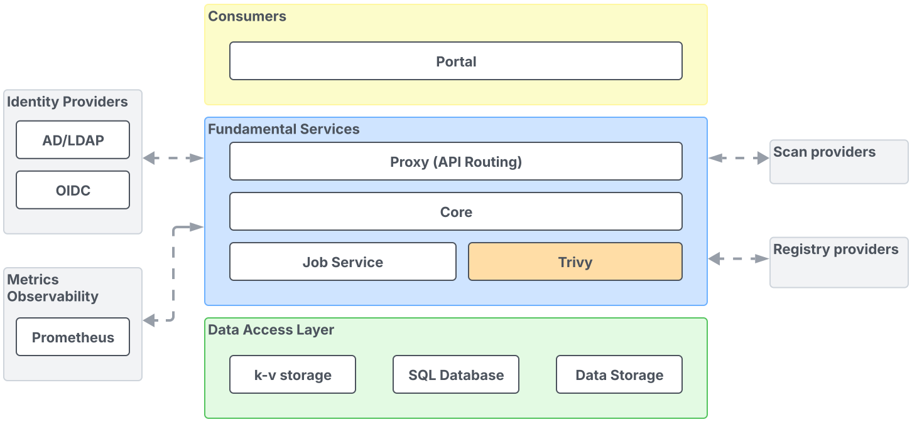

# Reference Architecture

The diagram shown below is the high-level architecture of the MSR 4 solution.

As per the diagram, the MSR 4 solution contains:

- [Consumers Layer](architecture-reference/consumers-layer.md)
- [Fundamental Services Layer](architecture-reference/fundamental-services-layer.md)
- [Data Access Layer](architecture-reference/data-access-layer.md)

MSR can also be integrated with various auxiliary services, for more
information refer to [integration](architecture-reference/integration.md).
