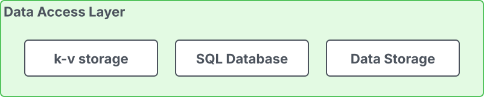

# Data Access Layer

The **MSR 4 Data Access Layer** manages data storage, retrieval, and caching
within the system. It encompasses **Key-Value storage** for caching,
an **SQL database** for storing metadata such as project details, user
information, policies, and image data, and **Data Storage**, which serves as
the backend for the registry.

| Data Access Layer Elements | Description |
|-----------------------------|--------------|
| **Key Value Storage** | MSR 4 **Key-Value (K-V) storage**, powered by **Redis**, provides data caching functionality and temporarily persists job metadata for the **Job Service**. |
| **Database** | The MSR 4 database stores essential metadata for Harbor models, including information on projects, users, roles, replication policies, tag retention policies, scanners, charts, and images. **PostgreSQL** is used as the database solution. |
| **Data Storage** | Multiple storage options are supported for data persistence, serving as backend storage for the **OCI-compatible registry**. |

