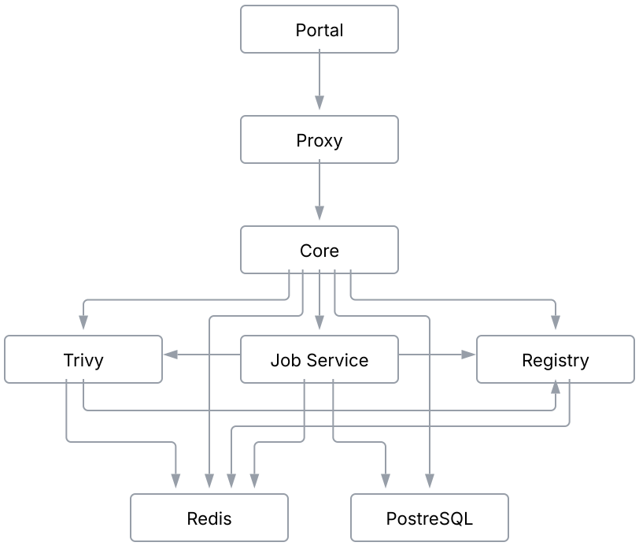

# Components Deployment

As previously emphasized, MSR 4 components operate as a Kubernetes workload.
This section provides a reference visualization of the resources involved in
deploying each component. Additionally, it outlines how service deployment
differs between a **single-node** and a **highly available (HA) setup**,
highlighting key structural changes in each approach.

MSR 4 deployment includes the following components:

- [Web Portal](web-portal.md)
- [Proxy](proxy.md)
- [Core](core.md)
- [Job Service](job-service.md)
- [Registry](registry.md)
- [Trivy](trivy.md)
- [K-V storage (Redis)](k-v-storage.md)
- [SQL Database (PostgreSQL)](sql-database.md)

The reference between these components is illustrated in the following diagram:

