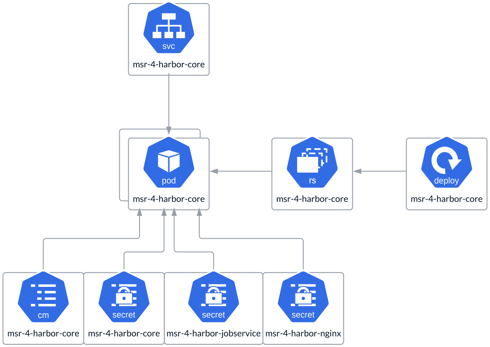

# Core

The **Core** is a monolithic application that encompasses multiple controller
and manager functions. The **Fundamental Services** → **Core** section
provides a detailed description. It is deployed as a **Replica Set**, with a
single instance for **All-in-One** deployments and multiple replicas for **HA**
deployments. These replicas are not quorum-based, meaning there are no limits
on the number of replicas. The instance count should be determined by your
specific use case and load requirements. To ensure high availability, it is
recommended to have at least two replicas. The Core uses a **ConfigMap** to
store non-sensitive configurations while securely attaching encrypted
parameters, such as passwords, to sensitive data.

