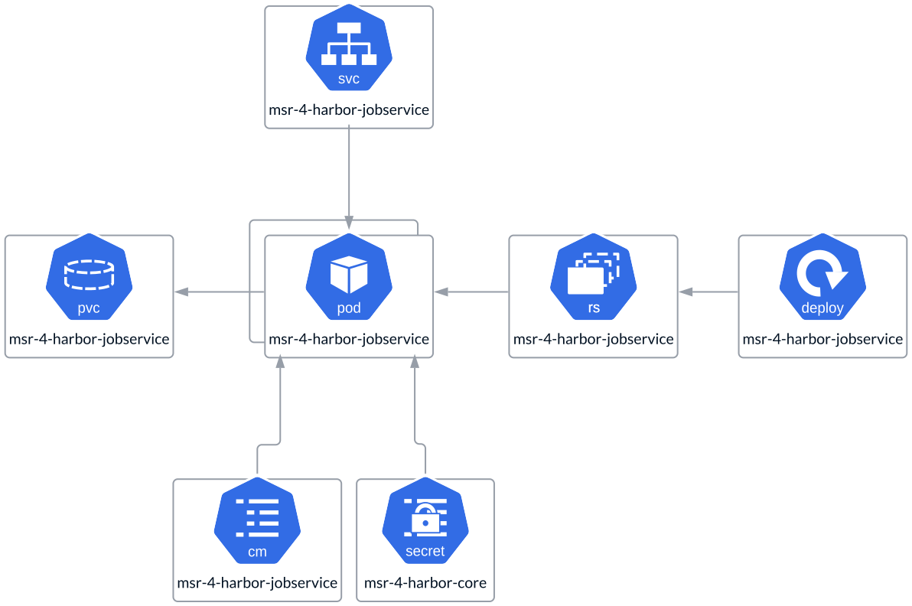

# Job Service

The **Harbor Job Service** runs as a **ReplicaSet**, with a single replica in
**All-in-One** deployments and multiple replicas in **HA** deployments. These
replicas are not quorum-based, meaning there are no limits on the number of
replicas. The instance count should be determined by your specific use case
and load requirements. To ensure high availability, it is recommended to have
at least two replicas. It utilizes a **PVC** to store job-related data, which
can be configured using local or remote shared storage. Refer to the
separate **Storage** section for more details on storage options.
The Job Service also uses a **ConfigMap** to retrieve the **config.yaml**
and a **Secret** to access sensitive parameters, such as keys and passwords.

