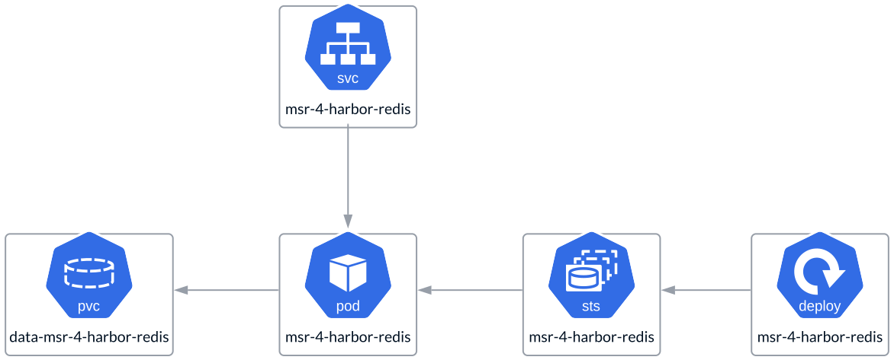
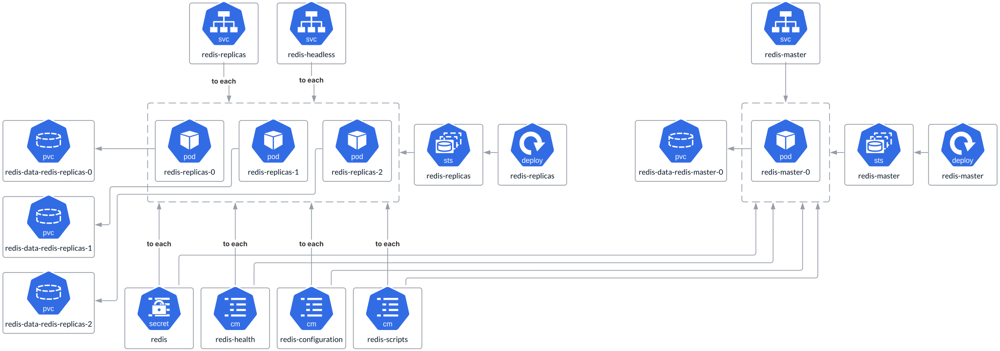

# K-V storage

Unlike other fundamental services in MSR 4, **K-V storage** is part of the
**Data Access Layer**. It can either be installed as a simplified,
single-instance setup using the same **Harbor Helm Chart suitable for
All-in-One deployments** or deployed in **HA mode** using a separate
**Redis Helm Chart**. Alternatively, an individual instance of **K-V storage**
can be used and integrated into MSR 4 as an independent storage service. In
this case, it is not considered part of the deployment footprint but rather
a dependency managed by a dedicated corporate team. While a remote service
is an option, it is not part of the reference architecture and is more
suited for specific customization in particular deployment scenarios.

## Single Node Deployment Redis

It is a simplified, single-instance **Redis** deployment that runs as
a **StatefulSet** and utilizes a **PVC** for storage.

## HA Deployment Redis

Unlike the previous single-instance deployment, this setup is more robust and
comprehensive. It involves deploying **K-V Redis storage** in replication mode,
distributed across multiple worker nodes. This configuration includes two
types of pods: **replicas** and **master**. Each pod uses a **PVC** for
storage and a **ConfigMap** to store scripts and configuration files, while
sensitive data, such as passwords, is securely stored in a **Secret**.

Redis is a quorum-based service, so the number of replicas should always be
odd—specifically 1, 3, 5, and so on.

