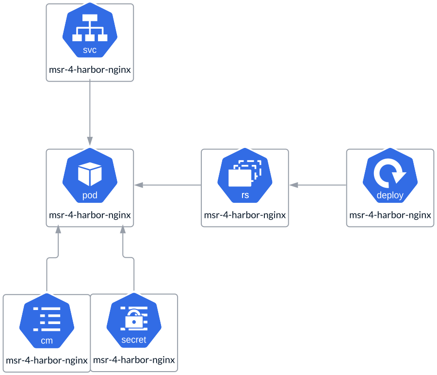

# Proxy (API Routing)

An **API proxy**, specifically **NGINX**, runs as a **ReplicaSet**. It can
operate with a single instance in **All-in-One** deployments or scale with
multiple instances in an **HA** deployment. The proxy uses a **ConfigMap** to
store the **nginx.conf** and a **Secret** to provide and manage
**TLS certificates**.

Important to know is that if services are exposed through **Ingress**,
the **NGINX Proxy** will not be utilized. It happens because the Ingress
controller in Kubernetes, often NGINX-based, handles the required tasks such
as load balancing and SSL termination. So in such a case, all the functionality
of an API Routing Proxy will be handed over to Ingress.

