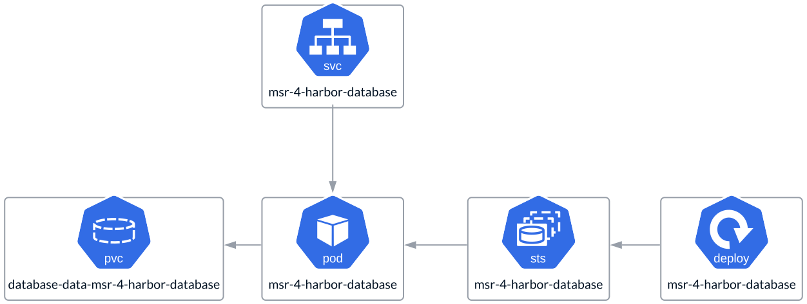
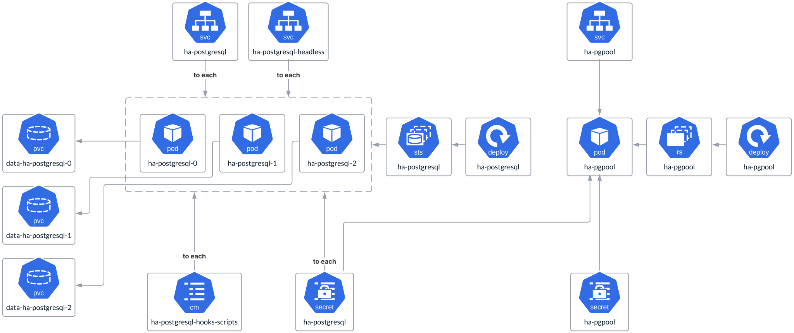

# SQL Database

Like **K-V Storage**, the **SQL Database service** is not part of
the **Fundamental Services** but is included in the **Data Access Layer**.
It can be installed as a simplified, single-instance setup using the same
**Harbor Helm Chart**, making it suitable for **All-in-One** deployments,
or deployed in **HA mode** using a separate **PostgreSQL Helm Chart**.
Alternatively, a separate **SQL** **Database** instance can be integrated
into **MSR 4** as an independent storage service. In this case, it is
considered a dependency rather than part of the deployment footprint and is
managed by a dedicated corporate team. While a remote service is an option,
it is not part of the reference architecture and is more suited for custom
deployments based on specific needs.

## Single Node Deployment

This is a streamlined, single-instance **PostgreSQL** deployment that runs as
a **StatefulSet** and utilizes a **PVC** for storage.

## HA Deployment

Unlike the previous single-node deployment, this setup is more robust and
comprehensive. It involves deploying **PostgreSQL** in replication mode across
multiple worker nodes. The configuration includes two types of pods:
**replicas**, managed as a **StatefulSet**, and **pgpool**, running as
a **ReplicaSet**. Each pod uses a **PVC** for storage and a **ConfigMap**
to store scripts and configuration files, while sensitive data, such as
passwords, is securely stored in a **Secret**.

Pgpool operates as an efficient middleware positioned between PostgreSQL
servers and PostgreSQL database clients. It maintains and reuses connections
to PostgreSQL servers. When a new connection request with identical properties
(such as username, database, and protocol version) is made, Pgpool reuses
the existing connection. This minimizes connection overhead and significantly
improves the system's overall throughput.

PostgreSQL is a quorum-based service, so the number of replicas should always
be odd—specifically 1, 3, 5, and so on.

