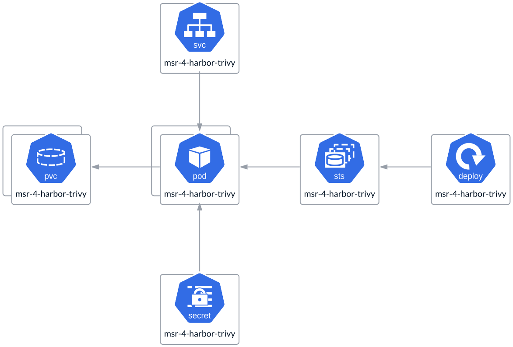

# Tivy

The **Trivy service** is deployed as a **StatefulSet** and utilizes a **PVC**,
with a separate volume for each Trivy instance. The number of instances can
range from a single instance in **All-in-One** deployments to multiple
instances in **HA** deployments. These replicas are not quorum-based,
meaning there are no limits on the number of replicas. The instance count
should be determined by your specific use case and load requirements. To
ensure high availability, it is recommended to have at least two replicas.
Trivy also uses a **Secret** to store connection details for the
**Key-Value store**.

