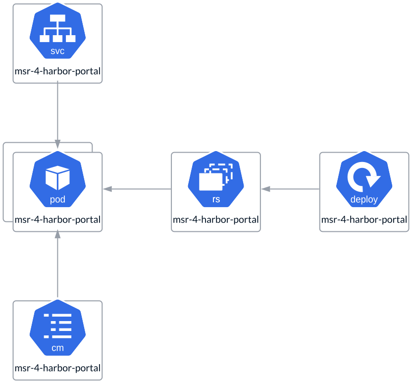

# Web Portal

The **Web Portal** is a graphical user interface designed to help users manage
images within the **Registry**. To ensure scalability and redundancy, it is
deployed as a **ReplicaSet**, with a single instance in an **All-in-One**
deployment and multiple instances in a **Highly Available (HA)** setup.
These replicas are not quorum-based, meaning there are no limits on the number
of replicas. The instance count should be determined by your specific use case
and load requirements. To ensure high availability, it is recommended to have
at least two replicas.

