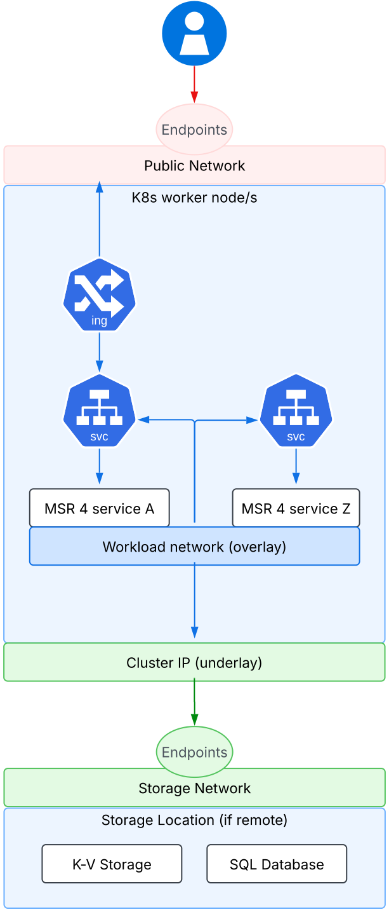

# Networking

MSR 4 is deployed as a workload within a Kubernetes (K8s) cluster and offers
multiple deployment options. The diagram below illustrates the network
communication between the MSR 4 components.

Network communication between the MSR 4 components varies depending on the
deployment configuration.

In a **closed deployment**, where all components—including Data Layer
services—are deployed within the same Kubernetes cluster (either as an
all-in-one or high-availability setup), communication occurs over the internal
workload network. These components interact through Kubernetes Service
resources, with the only externally exposed endpoints belonging to MSR 4.
To ensure security, these endpoints must be protected with proper firewall
configurations and TLS encryption.

For deployments where **Data Layer components are remote**, as depicted in
the diagram, communication must be secured between the Cluster IP network used
by Kubernetes worker nodes and the external endpoints of the key-value (K-V)
and database (DB) storage systems.

A comprehensive list of ports requiring security configurations can be found
in the [Network section](networking.md).